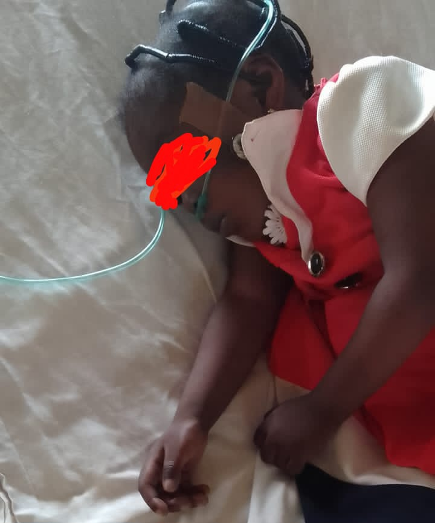
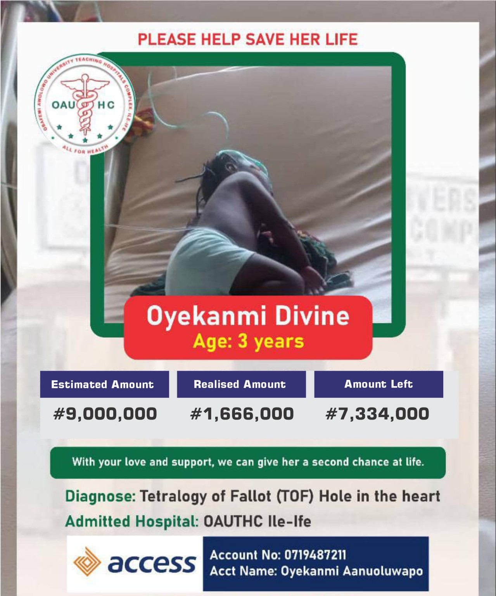

<!DOCTYPE html>
<html lang="en">
<head>
  <meta charset="UTF-8" />
  <meta name="viewport" content="width=device-width, initial-scale=1.0"/>
  <title>Help Save Divine Oyekanmi</title>
  
</head>
<body>

  <h1>Help Save Divine Oyekanmi</h1>

  
Dear Fathers, Friends, and Fellow Compatriots,

  
I write to you today with a burdened heart and a plea for help, on behalf of a little girl who deserves the chance to live.

  
<strong>Her name is Divine Oyekanmi.</strong> She’s just three years old—bright-eyed, full of promise, and already bearing a cross far too heavy for her tender age. Divine has been diagnosed with <em>Tetralogy of Fallot (TOF)</em> — a serious congenital heart condition, commonly called a hole in the heart. She is receiving care at <strong>OAUTHC, Ile-Ife</strong>, but without urgent intervention, her chances grow slimmer each day.

  
<strong>Her condition is deteriorating. Every breath is a battle. Every moment is a prayer.</strong>

  
I have known her parents personally for over a decade—they are loving, humble, and hardworking people. Watching their daughter suffer has left them emotionally drained and broken. Their world is falling apart, and they need our help—now.

  
We need to raise <strong>₦9,000,000</strong> for surgery, medical procedures, and hospital stay. It’s a huge mountain, but I believe with compassion, we can move it.

  <h2>How You Can Help</h2>

  

    
<strong>Direct Donation (Preferred):</strong> 
    <strong>0719487211</strong> - Access Bank - <strong>Oyekanmi Aanuoluwapo</strong>

  

  
Or reach out to me for coordination or questions:

  
<a href="https://wa.me/2349032201075">WhatsApp Me</a> or call <strong>09032201075</strong>

  <a class="donate-btn" href="https://wa.me/2349032201075" target="_blank">Donate Now via WhatsApp</a>

  

    <h2>Progress So Far</h2>
    
    
  

  
<em>Please don’t scroll past. You might be the answer to this little girl’s prayer.</em>

  
Together, we can save her. Please, help us.

  

    With sincerity and hope, 
    John Oyebanji 
    oyebanjijohn00@gmail.com 
    09032201075
  

</body>
</html>
